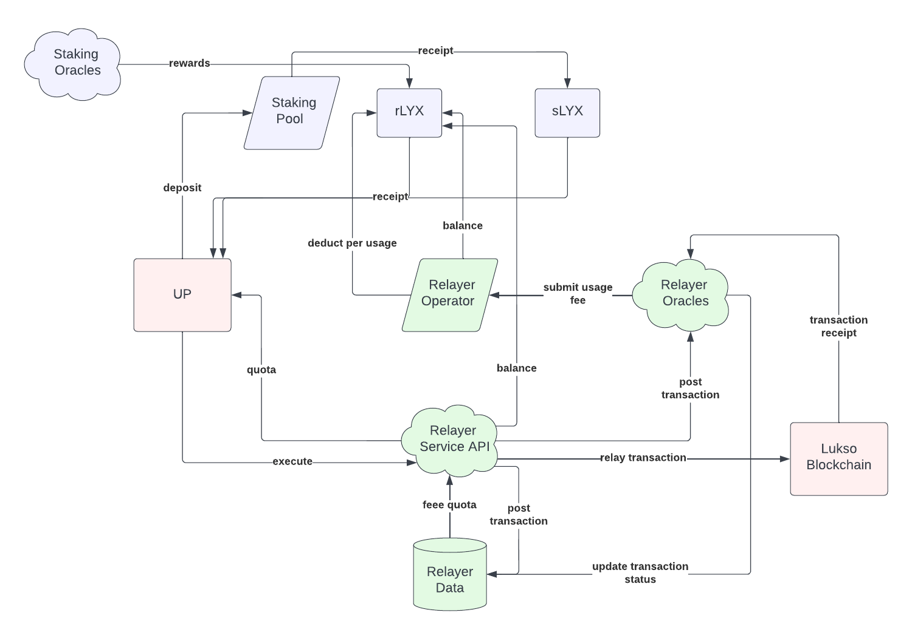

# Lukso Relayer Service

| Name | Description |
| ---- | ----------- |
| Project | Wise Relayer Service |
| Name | Volodymyr Lykhonis |
| Email | volodymyr@lykhonis.com |
| Frontend | [relayer-frontend](https://github.com/lykhonis/relayer-frontend) |
| Contracts | [relayer-contracts](https://github.com/lykhonis/relayer-contracts) |
| Oracles | [relayer-oracles](https://github.com/lykhonis/relayer-oracles) |

Video:

# Overview

Wise relayer service enables customers to leverage a staking pool to pay transaction fees on a blockchain.

There are at least 3 target customers:
1. Users who are new to the Lukso ecosystem
2. Users who own `LYX` and would like to earn `LYX` and pay no transaction fees
3. Businesses that buy and stake `LYX` to pay transaction fees for their customers

## How it works

- `purple`: a staking pool provider
- `pink`: Lukso blockchain
- `green`: Wise relayer service

### Staking Pool

A staking pool must be deployed and operated on Lukso blockchain. [Stakewise](https://stakewise.io/) has been leading and innovating on Ethereum mainnet for over a year. It provides a scalable dual token model:
- `sETH`: a staked `Eth` token
- `rETH`: a reward `Eth` token

Once withdrawals are enabled, both `sETH` and `rETH` can be safely redeemed to `Eth`. Following same architecture, there could be `sLYX` and `rLYX` ERC-20 tokens deployed and managed on Lukso blockchain.

Whenever a user deposits `LYX`, they receive same amount of `sLYX` and start earning `rLYX` directly deposited to their UP. By approving `rLYX` amount to be used by relayer's operator contract.

### Relayer Operator

Relayer operator contract facilitates tracking and deduction of `rLYX` from specific UP addresses. For example, whenever a transaction is made, relayer's EOA pays required fees. In the meantime, relayer's oracles are observing pending transaction status to determine exact amount of fees paid. Once transaction is settled (failed or succeded), oracles submit usage to relayer's operator contract, which calculatates a configurable service fee and deducts total `rLYX` balance from the user. Deducted `rLYX` is send transferred to relayer's EOA.

## Customers

### New Users

New users to Lukso ecosystem can leverage Wise relayer service to get 100 free transactions per month. This is subsidized through earned fees in `rLYX`.

### Users with LYX

Users who own `LYX` can deposit and start earning `rLYX`. They can bind their `rLYX` to pay for transaction fees. Users would continue earning rewards at a smaller rate and not worry about spending their `LYX`. In some countries, this can also be used to smooth taxation process as earned `rLYX` can be reused for fees being paid.

### Businesses with LYX

Businesses would purchase `LYX` and deposit it to a pool to start earning `rLYX`. This benefits business in several ways:
1. Business does not need to purchase more `LYX` as rewards might be sufficient to cover their customers fees
2. Original investment of `LYX` is not spent, but working for business itself

The relayer API works slightly different in this case. Businsess's UP that deposited `LYX`, can generate an API key. This API key can be configured to limit blockchain interraction to a preset list of contracts. Businesse's UP can modify the contract list at any point of time on the dashboard.

Customers can use the business's relayer API url to pay no fees when interraction with allowed contracts.
